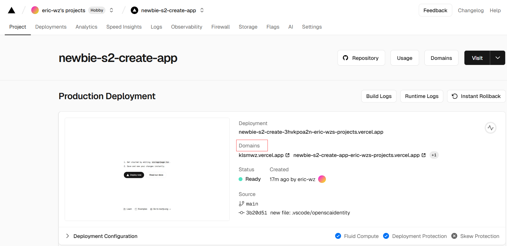

# Step 2: Create app and deploy on Vercel

## Getting Started
```bash
npx create-next-app@latest
```

## run the development server

```bash
npm run dev
```

Open [http://localhost:3000](http://localhost:3000) with your browser to see the result.

## Deploy on Vercel

- login:

  https://vercel.com/login
  

- Add New

  

- Import Git Repository

  

- Deploy

  

- Customize Domain

- 
  

- screenshot

  
  
